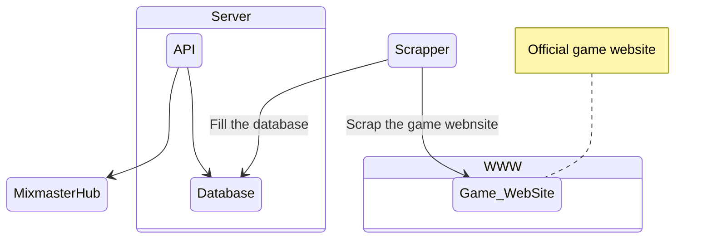

# Mixmaster Wiki

## Mixmaster Game

The Game website is located at https://mixmaster-online.fr/

> IP Address of the Game Server `164.132.203.180`

## Mixmaster unofficial application ecosystème

### Mixmaster Data

This is the SQL schema that is used by the unofficial mixmaster application.
It need to be created in first, otherwise some part of the mixmaster-hub won't work and the scrapper won't have a place to save the data.

> 📦 Repository [link](https://github.com/mixmaster-app/mixmaster-data)

#### Database Schema

```mermaid
erDiagram

    HENCH {
        int id
        string name
        string img_url
        int type_id
        int minimum_level
        int maximum_level
        tinyint atk_type
        boolean is_dropable
        boolean is_mixable
        boolean is_questable
        int hp
        int mp
        string attack
        int power
        int speed
        int accuracy
        int chance
    }
    HENCH_TYPE {
        int id
        string name
        int weakness_type_id
    }
    HENCH_ZONE {
        int zone_id
        int hench_id
    }
    HENCH_MIX {
        int id
        int hench_result_id
        int hench_left_id
        int item_left_id
        int hench_right_id
        int item_right_id
    }

    ZONE {
        int id
        string name
    }
    HENCH_LOOTS {
        int hench_id
        int item_id
        int zone_id
    }

    ITEM {
        int id
        string name
        string description
        int item_category_id
    }
    ITEM_CATEGORY {
        int id
        string name
    }

    USER {
        int id
        string nickname
        int level
        double percent
        int character_type_id
    }
    CHARACTER_TYPE {
        int id
        string name
        string img_url
    }

    USER_ITEM {
        int user_id
        int item_id
        int quantity
    }
    USER_HENCH {
        int user_id
        int hench_id
        int level
        int hench_nature_id
        int gender_id
    }
    HENCH_GENDER {
        int id
        string name
    }
    HENCH_NATURE {
        int id
        string name
    }

    GUILD {
        int id
        string name
    }
    GUILD_USER {
        int guild_id
        int user_id
        string role
    }

```

### Mixmaster Scrapper

A Scrapper is then used to populate this database, it works only in cli and has no interface at all.\
It Does not have an help section either.

> 📦 Respository [link](https://github.com/mixmaster-app/mixmaster-scrapper)

### Mixmaster API

Mixmaster unofficial [API](https://github.com/mixmaster-app/mixmaster-api) that works with the desktop application.

> Address of the unofficial API http://51.15.253.45:7150/api

> 📦 Repository [link](https://github.com/mixmaster-app/mixmaster-api)

There was also an older API written in Java.\
Archived Repository [link](https://github.com/mixmaster-app/mixmaster-api-old)

#### Available Routes [swagger](http://51.15.253.45:7150/api/swagger)

 - Zone
   - `/zones` List every zones of the game
 - Hench
   - `/henchs` List every hench of the game
   - `/hench/{id}` Get one hench by its id
   - `/hench/search/{search}` Search an hench which name contain the search
   - `/hench/filter/{search}` Search an hench which name contain the search AND add some more filters (type, minimum/maximum level)
   - `/hench/{id}/evolutions` Get every evolution available for the hench id
   - `/hench/{id}/mixs` Get every mixs duable with the given hench id

### Mixmaster Hub

This is the main application developped using [Electron](https://www.electronjs.org/fr/) and [Vue.js](https://vuejs.org/)

> 📦 Repository [link](https://github.com/mixmaster-app/mixmaster-hub)

If you need to rebuild the application you'll need to edit the config file located in `src\config\Config.js` with the correct api IP address and the game IP.

## Architecture of those applications

